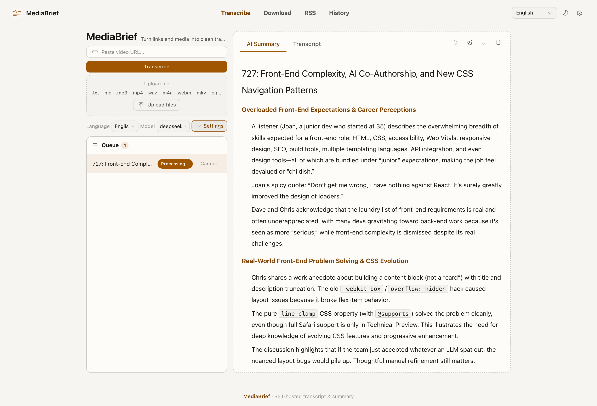
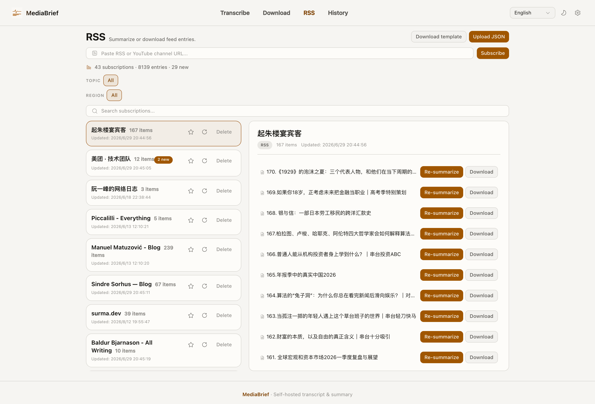
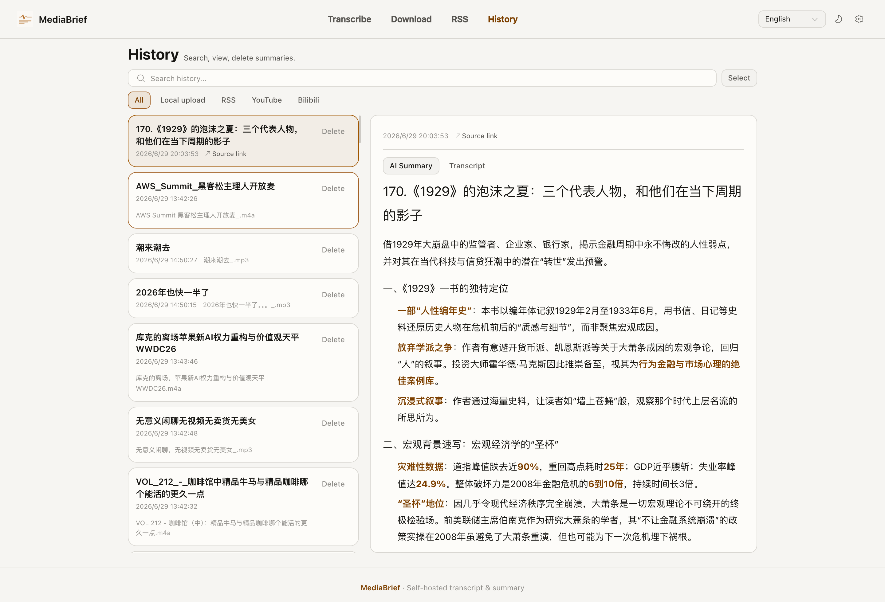

<div align="center">

# MediaBrief

**macOS app for AI video transcription & summarization — YouTube, Bilibili, podcasts, and 30+ platforms.**

English | [中文](README_ZH.md) | [日本語](README_JA.md) | [한국어](README_KO.md)

[](LICENSE)
[](https://github.com/EvilIrving/mediabrief/stargazers)
[](https://github.com/EvilIrving/mediabrief/releases/latest)

**MediaBrief** is a **macOS** (Apple Silicon) app: paste a YouTube, Bilibili, TikTok, Apple Podcasts, or other link, or drop a local file. **Subtitles first** when captions exist; **Whisper** when they don't. An **LLM** cleans the transcript and streams an **AI summary**. RSS, Telegram/Slack bots, and optional TTS are built in.

Download the signed, notarized DMG. Docker and self-hosted install are not part of this product — that line lives on the [`self-hosted`](https://github.com/EvilIrving/mediabrief/tree/self-hosted) branch.

<!-- Absolute URL so GitHub.com renders a playable player for visitors (not only local clones). Drop the recording at docs/img/demo.mp4 then push main. -->
https://github.com/EvilIrving/mediabrief/raw/main/docs/img/demo.mp4





</div>

## ✨ Features

- **Multi-platform**: YouTube, TikTok, Bilibili, Apple Podcasts, SoundCloud, and 30+ more via yt-dlp
- **Local files**: Drag in `.mp3`, `.mp4`, `.m4a`, `.wav`, `.webm`, `.mkv`, `.ogg`, `.flac`, or `.txt` (skip transcription, go straight to summary). Media is normalized with FFmpeg before Whisper
- **Subtitles first**: Existing captions are pulled without downloading audio at all. Whisper only kicks in when subtitles aren't available. This covers most YouTube videos and saves a lot of time
- **Whisper fallback**: Speech-to-text via mlx-whisper on Apple Silicon when no subtitles exist
- **LLM cleanup**: Typo correction, sentence completion, and paragraphing via the configured LLM
- **Multi-language summaries**: 10+ languages, with automatic translation when source and target languages differ
- **Summary delivered first**: Summaries run in parallel with transcript optimization, so you can read the summary while the full transcript is still being cleaned up
- **Two-step summary** (optional): The LLM first drafts a tailored summary prompt, then generates the final summary from it. Often produces better results for long content
- **Retry without re-processing**: Re-generate summary and transcript from saved raw text. No re-download or re-transcription needed
- **Multi-language UI**: English, 中文, 日本語, 한국어
- **Light / dark theme**: Single-button toggle
- **Ready on first launch**: the Mac app is meant to work without pasting an API key. Settings still let you point at your own OpenAI-compatible endpoint if you want.
- **Unified task queue**: Every job — pasted links, file uploads, downloads, and RSS items — flows into one queue on the home page and runs one at a time. Watch live progress, open finished results, or cancel any item. The same task can be queued more than once
- **RSS subscriptions**: Subscribe to RSS feeds or YouTube channels. Refresh entries, summarize or download items with one click
- **Media downloads**: Detect available video, audio, and subtitle formats, then download what you need
- **Export to multiple formats**: MD, TXT, DOCX, PDF
- **Share as image**: Export a summary card as PNG for sharing
- **Telegram / Slack bots**: Send a link to your bot; get the summary plus full transcript back as a file
- **Optional TTS**: Configure Doubao TTS in Settings to read summaries aloud
- **Local history**: summaries stay on this Mac in SQLite. Search, filter by source, and manage them from History

[](https://star-history.com/#EvilIrving/mediabrief&Date)

## 🚀 Quick Start

### Download the Mac app

Get the signed Apple Silicon DMG from [GitHub Releases](https://github.com/EvilIrving/mediabrief/releases/latest). Drag MediaBrief into Applications and open it.

### Develop from source

This path is for contributing and packaging the app, not for end-user install.

```bash
git clone git@github.com:EvilIrving/mediabrief.git
cd mediabrief

python3 -m venv venv
source venv/bin/activate
pip install --upgrade pip setuptools wheel
pip install -r requirements.txt

brew install ffmpeg

cd frontend && pnpm install && pnpm build && cd ..
python3 start.py
```

Or run both servers with hot reload: `pnpm dev` (API at `:8000`, web at `:5173`).

### Frontend Development

The web UI is a React + TypeScript SPA in `frontend/`. You only need this to **modify** the UI:

```bash
cd frontend
pnpm install

# Production build → outputs to static/ (then run start.py)
pnpm build

# Or live dev server with HMR (proxies /api to FastAPI on :8000)
pnpm dev
```

To open the development UI in a standalone Chrome app window on macOS:

```bash
open -na "Google Chrome" --args --app="http://localhost:5173"
```

### Testing

Both the backend (pytest) and frontend (Vitest) have unit test suites.

```bash
# Everything (backend + frontend)
pnpm test

# Backend only — pytest (install dev deps first)
pip install -r requirements-dev.txt
pnpm test:api

# Frontend only — Vitest (jsdom + Testing Library)
pnpm test:web            # one-shot
cd frontend && pnpm test:watch   # watch mode
```

LLM-facing output (transcript optimization, summaries, translation) is constrained with
structured/tagged output and covered by unit tests, so this behaviour does not need manual checking.

## 📖 Usage Guide

1. **Choose input — URL or file**
   - **URL**: Paste a link from YouTube, Bilibili, or any supported platform
   - **Local file**: Drag a file onto the dashed upload area, or click to browse. `.txt` files skip transcription entirely and go straight to summary generation
2. **Select Summary Language**: Pick the output language from the dropdown
3. **(Optional) Configure AI Model**: Click **Settings** to expand the model panel
   - Enter your **API Base URL** and **API Key**
   - Click **Fetch** to load the model list
   - Select a model
4. **Start Processing**: Click **Transcribe**. The progress bar shows which mode is active:
   - **⚡ Subtitle** (green) — captions found, transcript extracted in seconds
   - **🎙 Whisper** (amber) — no captions; downloading audio for transcription
5. **Read the Summary First**: The summary appears as soon as the LLM finishes, while the full transcript continues optimizing in the background
6. **View Results**: Review the optimized transcript, translation (auto-generated when languages differ), and summary
7. **Retry if Needed**: Click **Retry** to re-generate summary and transcript from the raw text using a different model or language
8. **Browse History**: Open the **History** tab to search, filter by source, and manage past summaries stored in SQLite
9. **RSS Automation**: Open the **RSS** tab, subscribe to RSS feeds or paste a YouTube channel URL. Refresh entries, summarize or download items with one click. Queued items run in the unified queue on the **Transcribe** tab, where you can track progress and cancel — the RSS tab itself just enqueues
10. **Download Media**: Open the **Download** tab to detect formats and download video, audio, or subtitle files
11. **Export Results**: Click the Export button to save transcript, summary, or translation as Markdown, TXT, DOCX, or PDF

## 🛠️ Technical Architecture

### Backend Stack
- **FastAPI** — Async web framework with SSE streaming
- **yt-dlp** — Video/audio/subtitle extraction from 1,800+ sites
- **FFmpeg** — Audio normalization (mono 16 kHz for Whisper)
- **mlx-whisper** — on-device speech-to-text on Apple Silicon
- **OpenAI SDK** — Summary generation, transcript optimization, and translation via any compatible API

### Frontend Stack
- **React + TypeScript** — Componentized SPA with client-side page routing (React Router, `HashRouter`)
- **Vite** — Build tooling; outputs to `static/`, served by FastAPI under `/static/`
- **Tailwind CSS v3.4** — Utility styling over oklch design tokens (light/dark theming)
- **Marked** — Client-side Markdown rendering
- **Fluent UI icons** — `@fluentui/react-icons` (plus a small SVG sprite helper)


### Project Structure

```
mediabrief/
├── backend/                     # Backend code
│   ├── main.py                 # FastAPI app assembly, middleware, route registration
│   ├── services.py             # Shared singleton instances (processors, upload config)
│   ├── pipeline.py             # Orchestration layer: post-extract pipeline, task executors
│   ├── task_store.py           # Task state machine, stage weights, SSE broadcast
│   ├── video_processor.py      # yt-dlp wrapper: download, format detection, subtitle fetch
│   ├── platforms/              # Per-platform download adapters (YouTube, Bilibili, etc.)
│   ├── feeds/                  # Per-platform feed adapters (YouTube channel → RSS)
│   ├── transcriber.py          # mlx-whisper transcription
│   ├── summarizer.py           # LLM summary generation (single-step & two-step)
│   ├── translator.py           # LLM-based translation with language detection
│   ├── exporter.py             # Multi-format export engine (MD, TXT, DOCX, PDF)
│   ├── llm_sanitize.py         # Strip LLM boilerplate from model output
│   ├── db.py                   # SQLite database layer (tasks, history, RSS feeds)
│   ├── rss_reader.py           # RSS/Atom feed parser with SQLite persistence
│   └── routers/
│       ├── __init__.py
│       ├── core.py             # Static page serving, model list proxy, health check
│       ├── transcribe.py       # URL/upload processing, task status, SSE, retry
│       ├── downloads.py        # Video/audio/subtitle download endpoints
│       ├── export.py           # Export transcript/summary/translation as MD/TXT/DOCX/PDF
│       └── rss.py              # RSS subscription, entry listing, task creation
├── frontend/                   # React + TypeScript SPA (source)
│   ├── src/
│   │   ├── main.tsx            # Entry point
│   │   ├── App.tsx             # Providers + HashRouter + page routes
│   │   ├── index.css          # Design tokens + ported component styles + Tailwind
│   │   ├── lib/               # api.ts, types.ts, markdown.ts
│   │   ├── context/          # Theme, Settings, TaskHandoff providers
│   │   ├── i18n/             # UI language dictionaries + provider
│   │   ├── components/       # Navbar, Footer, IconSprite, ErrorBanner, Markdown
│   │   └── features/         # transcribe / download / rss / history pages
│   ├── vite.config.ts         # base=/static/, outDir=../static, /api proxy
│   └── package.json
├── static/                     # Built SPA (pnpm build; served by FastAPI at /static/)
├── docs/img/                   # README screenshots + demo.mp4
├── scripts/
│   ├── build_macos.sh          # macOS .app bundle builder
│   └── sign_and_package.sh     # macOS code-sign, notarize, DMG packaging
├── pyinstaller/
│   └── ai_transcriber.spec     # PyInstaller spec for desktop builds
├── temp/                       # SQLite DB + temp files (transcripts, summaries, downloads)
├── requirements.txt            # Python dependencies (lower-bound pinned)
├── start.py                    # Desktop launcher: uvicorn + pywebview
├── recommended_rss_feeds.json  # Pre-built RSS feed list for import
└── README.md                   # This file
```

## ⚙️ Configuration Options

### In-app Settings

API Base URL, API Key, model, summary language, and two-step summary are configured in the UI **Settings** panel. The backend no longer reads `.env` or environment-variable fallbacks for model/API configuration.

### Whisper Model Sizes

| Model | Params | Multilingual | Speed | Memory |
|-------|--------|-------------|-------|--------|
| base | 74 M | ✓ | Fast | ~150 MB |
| small | 244 M | ✓ | Medium | ~750 MB |
| medium | 769 M | ✓ | Slow | ~1.5 GB |
| **large-v3-turbo** (default) | 809 M | ✓ | Fast | ~1.6 GB |
| large-v3 | 1550 M | ✓ | Very Slow | ~3 GB |

**`large-v3-turbo` is the default** — the best speed/accuracy/memory balance on CPU for all four UI languages (incl. CJK). It downloads automatically on first use. The standard package does not embed `base`; set `MEDIABRIEF_BUNDLE_BASE_MODEL=1` while building if an offline fallback is required. yt-dlp is also kept fresh via a throttled weekly background self-update so platform extractors don't go stale.

## 🔧 FAQ

### Q: Why is the summary available before the transcript?
A: The pipeline generates the summary in parallel with transcript optimization. Since the summary only needs a lightly cleaned version of the raw text, it finishes quickly while the full transcript continues polishing in the background.

### Q: Can I change the model or language without re-processing the whole video?
A: Yes. Use the **Retry** button to re-run only the optimization + summary step on the saved raw transcript — no re-download or re-transcription needed.

### Q: What's the "two-step summary" option?
A: When enabled, the LLM first generates a tailored summary prompt based on the content and target language, then uses that prompt to produce the final summary. This often yields better structured results for long or complex content.

### Q: Which platforms are supported?
A: All platforms supported by yt-dlp — YouTube, TikTok, Facebook, Instagram, Twitter/X, Bilibili, Youku, iQiyi, Tencent Video, and 1,800+ more.

### Q: What local file types and size limits apply?
A: `.txt`, `.mp3`, `.mp4`, `.m4a`, `.wav`, `.webm`, `.mkv`, `.ogg`, `.flac`. Default max is **200 MB** per file.

### Q: How do I configure the AI model?
A: Open the **Settings** panel in the UI, enter your API Base URL and API Key, click **Fetch** to load available models, then select one. No server restart required.

### Q: Dev server won't stop with Ctrl+C, or "Address already in use" on restart?
A: These are common in dev mode with `concurrently` + `uvicorn --reload`. Solutions:
- Run `pnpm stop` to forcefully kill port 8000 and 5173
- If Ctrl+C hangs, the Whisper prewarm thread may be keeping the process alive — use `pnpm stop`
- The dev script now excludes `temp/*` from uvicorn's file watcher to prevent reload loops on migration

### Q: YouTube fails with "Sign in to confirm you're not a bot"?
A: yt-dlp includes built-in JS challenge solvers. Ensure you have **Deno** or **Node.js** installed: `brew install deno` (macOS) or `apt install nodejs` (Debian/Ubuntu).

### Q: Why am I getting HTTP 500 errors?
A: Check the following:
- Virtual environment is activated: `source venv/bin/activate`
- Dependencies are installed: `pip install -r requirements.txt`
- FFmpeg is installed: `ffmpeg -version`
- API Base URL, API key, and model are configured in the UI Settings panel
- Port 8000 is not already in use

### Q: Memory requirements?
A:
- **Idle**: ~50–100 MB
- **Processing peak**: app + Whisper model + ~500 MB for media
- **Recommended**: 4 GB+ RAM; `large-v3-turbo` needs about 1.6 GB for the model

### Q: Where did Docker / self-hosted install go?
A: That line is on the [`self-hosted`](https://github.com/EvilIrving/mediabrief/tree/self-hosted) branch. `main` ships the Mac app only.

## 🖥️ macOS Desktop App

```bash
# One-time setup
python3 -m venv venv && source venv/bin/activate
pip install -r requirements.txt pyinstaller pywebview
brew install librsvg

# Build without an embedded LLM key (default; users configure it in the UI)
bash scripts/build_macos.sh

# Build with the ignored release-config.json or MEDIABRIEF_LLM_* variables
bash scripts/build_macos.sh --with-key

# Run (the default large-v3-turbo downloads in the background on first launch)
open "dist/MediaBrief.app"

# API key / model settings
# A build without an embedded key exposes these fields in the in-app Settings panel

# One-time setup: stores notarization credentials in macOS Keychain
bash scripts/sign_and_package.sh setup-notary

# Sign, notarize and staple both the app and final DMG
bash scripts/sign_and_package.sh notarize

# Release follows the same switch: no embedded key by default
bash scripts/release_macos.sh --with-key
```

The release script only accepts a valid `Developer ID Application` identity. Any
code-signing, notarization, stapling, disk-image, or Gatekeeper failure stops the
release with a non-zero exit code. It never accepts an Apple password through an
environment variable or stores one in the repository.

> **First run tip**: launch from terminal — `"dist/MediaBrief.app/Contents/MacOS/mediabrief"`. If dozens of processes spawn, `pkill -9 -f mediabrief` and rebuild.

## 🎯 Supported Languages

### Transcription
100+ languages through Whisper — automatic language detection, high accuracy for major languages.

### Summary Languages
English, 中文（简体）, 日本語, 한국어, Español, Français, Deutsch, Português, Русский, العربية, and more.

## 📈 Performance Estimates

| Video Length | Subtitle Mode | Whisper Mode | Notes |
|-------------|---------------|--------------|-------|
| 1 min | ~5 s | 30 s – 1 min | Subtitle mode needs no download |
| 5 min | ~10 s | 2 – 5 min | Most YouTube videos trigger subtitle mode |
| 15 min | ~15 s | 5 – 15 min | Summary appears first in both modes |
| 30+ min | ~20 s | 15 – 60 min | Podcasts always use Whisper |

## 🤝 Contributing

Issues and Pull Requests are welcome!

1. Fork the project
2. Create a feature branch (`git checkout -b feature/AmazingFeature`)
3. Commit your changes (`git commit -m 'Add AmazingFeature'`)
4. Push to the branch (`git push origin feature/AmazingFeature`)
5. Open a Pull Request

## Acknowledgments

- [yt-dlp](https://github.com/yt-dlp/yt-dlp) — Universal video/audio extractor
- [mlx-whisper](https://github.com/ml-explore/mlx-examples) for on-device speech-to-text on Apple Silicon
- [FastAPI](https://fastapi.tiangolo.com/) — Modern async Python web framework
- [OpenAI](https://openai.com/) — LLM API for summaries and text optimization

## 📞 Contact

For questions or suggestions, please open an Issue.

---

## ⭐ Star History

If this project is useful, please consider giving it a star!
