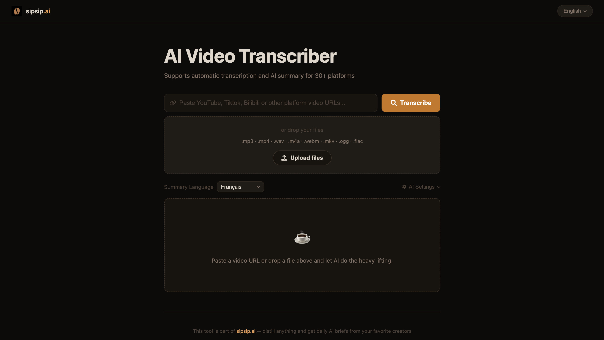

<div align="center">

# AI Video Transcriber

[English](README.md) | [中文](README_ZH.md) | 日本語 | [한국어](README_KO.md)

動画・ポッドキャストの文字起こし、翻訳、要約、履歴保存を行うオープンソースツールです。YouTube、Bilibili、TikTok、Apple Podcasts、SoundCloud など 30+ プラットフォームの URL と、ローカルの音声・動画・テキストファイルに対応します。



</div>

## ✨ 主な機能

- 🎥 YouTube / Bilibili / TikTok / Podcast など 30+ プラットフォーム対応
- 📁 ローカルアップロード: `.txt`, `.mp3`, `.mp4`, `.m4a`, `.wav`, `.webm`, `.mkv`, `.ogg`, `.flac`
- ⚡ 字幕優先: 字幕がある場合は音声ダウンロードなしで高速に処理、なければ Faster-Whisper にフォールバック
- 🤖 OpenAI 互換 API によるテキスト最適化、翻訳、要約
- 🌍 要約言語の選択と条件付き翻訳
- 🌐 UI 言語: English / 中文 / 日本語 / 한국어
- 🗂️ IndexedDB による要約履歴: History タブでオンライン閲覧、検索、削除
- 📡 RSS: フィード購読、更新、項目ごとの要約・ダウンロードタスク作成
- ⬇️ Download タブ: 動画、音声、字幕を検出してダウンロード

## 🚀 クイックスタート

```bash
git clone git@github.com:EvilIrving/ai-transcriber.git
cd ai-transcriber
chmod +x install.sh
./install.sh
python3 start.py --prod
```

Docker を使う場合:

```bash
cp .env.example .env
docker-compose up -d
```

必要なもの: Python 3.8+、FFmpeg、OpenAI 互換プロバイダーの API Key（UI の AI Settings から設定可能）。

## 📖 使い方

1. Transcribe タブで URL を貼り付けるか、ローカルファイルをアップロードします。
2. 要約言語と、必要に応じて AI Settings の API Base URL / API Key / Model を設定します。
3. **Transcribe** をクリックします。
4. Transcript / AI Summary / Translation を画面上で確認します。
5. History タブで保存済み要約を検索・閲覧・削除できます。
6. RSS タブでフィードを購読し、各項目から要約やダウンロードタスクを作成できます。
7. Download タブで動画・音声・字幕ファイルを保存できます。

## 🧩 フロントエンド構成

```text
static/
├── index.html
├── app.js              # 初期化と各モジュールの接続
└── js/
    ├── i18n.js         # UI 翻訳辞書と i18n ヘルパー
    ├── ui.js           # テーマ、設定、コピー/ダウンロード補助
    ├── transcribe.js   # 文字起こしタスクと SSE
    ├── download.js     # 動画/音声/字幕ダウンロード
    ├── history.js      # IndexedDB 要約履歴
    └── rss.js          # RSS 購読とタスク操作
```

## ライセンス

MIT License
